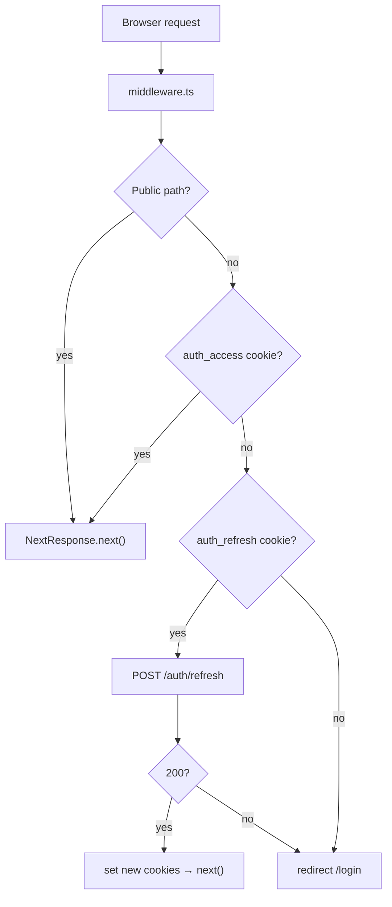

# Frontend Plan — Multi-Tenant SaaS (Next.js)

> **HOW TO FOLLOW THIS PLAN (read first).**
> This plan **upgrades the existing MVP frontend** to match the new SaaS backend (`clinidoc-api` after the 2026-06-20 auth plan). The backend is already built and running.
>
> **Rules:** Do tasks in order. Write exact files shown. Where a task has a test, run it red → implement → run it green. Use the precise names shown — later tasks depend on them.
>
> **Prerequisites:** Node 20+. The backend (`clinidoc-api`) must be running on `http://localhost:8000`.

---

## What changes conceptually

- **MVP:** one `BACKEND_API_KEY` env var; every server-side fetch included `X-API-Key`.
- **SaaS:** humans log in (email + password → JWT). Two `httpOnly` cookies hold the tokens. `middleware.ts` silently refreshes the access token. Server Components and Actions read the token via `cookies()`.

```
User → browser → Next.js (reads cookie) → Bearer <access> → NestJS
                  └─ middleware.ts silently refreshes when token is expired
```

The browser **never sees the JWT** in JavaScript — it lives only in httpOnly cookies.

---

## Auth flow diagram



---

## Session cookies

| Cookie | Content | Flags |
|--------|---------|-------|
| `auth_access` | JWT access token (15 min) | httpOnly, SameSite=lax, Secure in prod |
| `auth_refresh` | opaque refresh token (30 days) | httpOnly, SameSite=lax, Secure in prod |

---

## File structure changes vs MVP

**New files:**
```
middleware.ts
lib/auth.ts                          ← session helpers (getSession, setAuthCookies, clearAuthCookies)
app/login/         page.tsx · actions.ts
app/signup/        page.tsx · actions.ts
app/forgot-password/ page.tsx · actions.ts
app/reset-password/  page.tsx · actions.ts
app/invitations/accept/ page.tsx · actions.ts
app/org/           page.tsx · actions.ts
app/review/failed/ page.tsx · actions.ts
```

**Modified files:**
```
.env.local.example                   ← remove BACKEND_API_KEY
lib/types.ts                         ← add User, AuthResponse, OrgUser, FailedDoc
lib/api.ts                           ← complete rewrite (JWT, no X-API-Key)
components/Nav.tsx                   ← show current user name + logout button
app/roster/page.tsx · actions.ts     ← add rematch trigger
e2e/flow.spec.ts                     ← add login step
README.md                            ← update auth section
```

**Unchanged files (zero changes):**
```
lib/format.ts · tests/format.test.ts
components/Badge.tsx · tests/badge.test.tsx
components/ReviewTable.tsx · tests/reviewTable.test.tsx
app/layout.tsx · app/globals.css
app/page.tsx (review queue)
app/api/raw/[id]/route.ts            ← tiny: use JWT header instead of API-Key
app/api/patients/route.ts
app/review/[id]/page.tsx
app/review/[id]/actions.ts
app/upload/page.tsx · actions.ts
app/dashboard/page.tsx
components/Stat.tsx · components/PatientPicker.tsx
```

---

## Task 1: Update `.env.local.example`

**File:** `.env.local.example`

```
BACKEND_URL=http://localhost:8000
```

Remove `BACKEND_API_KEY`. Tokens come from cookies at runtime; no server-side key is needed.

---

## Task 2: Extend types + add session helpers

**Files:** `lib/types.ts` (add), `lib/auth.ts` (create)

### `lib/types.ts` — add after existing types:
```ts
export const AuthResponse = z.object({
  access: z.string(), refresh: z.string(),
  user: z.object({ id: z.string(), email: z.string(), name: z.string(), role: z.string(), tenantId: z.string() }),
});
export type AuthResponse = z.infer<typeof AuthResponse>;

export const OrgUser = z.object({ id: z.string(), email: z.string(), name: z.string(), role: z.string() });
export type OrgUser = z.infer<typeof OrgUser>;

export const FailedDoc = z.object({ id: z.string(), doc_type: z.string().nullable(), error: z.string().nullable(), created_at: z.string() });
export type FailedDoc = z.infer<typeof FailedDoc>;
```

### `lib/auth.ts`:
```ts
import "server-only";
import { cookies } from "next/headers";
import { redirect } from "next/navigation";

export type Session = { userId: string; tenantId: string; role: string; email: string; access: string };

export async function getSession(): Promise<Session | null> {
  const store = await cookies();
  const access = store.get("auth_access")?.value;
  if (!access) return null;
  try {
    const payload = JSON.parse(atob(access.split(".")[1].replace(/-/g, "+").replace(/_/g, "/")));
    return { userId: payload.sub, tenantId: payload.tid, role: payload.role, email: payload.email, access };
  } catch { return null; }
}

export async function requireSession(): Promise<Session> {
  const session = await getSession();
  if (!session) redirect("/login");
  return session;
}

export async function setAuthCookies(access: string, refresh: string) {
  const store = await cookies();
  const opts = { httpOnly: true, sameSite: "lax" as const, path: "/" };
  store.set("auth_access", access, opts);
  store.set("auth_refresh", refresh, opts);
}

export async function clearAuthCookies() {
  const store = await cookies();
  store.delete("auth_access");
  store.delete("auth_refresh");
}
```

---

## Task 3: Rewrite `lib/api.ts`

**File:** `lib/api.ts` — complete replacement

```ts
import "server-only";
import { ReviewItem, ReviewDetail, Patient, Metrics, OrgUser, FailedDoc } from "./types";
import { getSession } from "./auth";

const BASE = process.env.BACKEND_URL!;

async function authHeaders() {
  const session = await getSession();
  if (!session) throw new Error("Not authenticated");
  return { Authorization: `Bearer ${session.access}`, "Content-Type": "application/json" };
}

async function get(path: string) {
  const r = await fetch(`${BASE}${path}`, { headers: await authHeaders(), cache: "no-store" });
  if (!r.ok) throw new Error(`GET ${path} → ${r.status}`);
  return r.json();
}

async function post(path: string, body?: unknown, isFormData = false) {
  const headers = await authHeaders();
  if (isFormData) delete (headers as any)["Content-Type"];
  const r = await fetch(`${BASE}${path}`, {
    method: "POST", headers,
    body: isFormData ? (body as FormData) : JSON.stringify(body ?? {}),
  });
  if (!r.ok) throw new Error(`POST ${path} → ${r.status}`);
  return r.json();
}

export const api = {
  listReview:     async () => ReviewItem.array().parse(await get("/review")),
  getReview:      async (id: string) => ReviewDetail.parse(await get(`/review/${id}`)),
  listFailed:     async () => FailedDoc.array().parse(await get("/review/failed")),
  searchPatients: async (q: string) => Patient.array().parse(await get(`/patients?q=${encodeURIComponent(q)}`)),
  metrics:        async () => Metrics.parse(await get("/metrics")),
  listOrgUsers:   async () => OrgUser.array().parse(await get("/org/users")),
  confirm:   (id: string, body: { patient_id?: string | null; doc_type?: string | null; accepted_unchanged: boolean }) =>
               post(`/review/${id}/confirm`, body),
  retry:     (id: string) => post(`/review/${id}/retry`),
  upload:    (form: FormData) => post("/ingest/upload", form, true),
  importRoster: (form: FormData) => post("/roster/import", form, true),
  rematch:   () => post("/roster/rematch"),
  invite:    (email: string, role: string) => post("/org/invitations", { email, role }),
  setRole:   (userId: string, role: string) => fetch(`${BASE}/org/users/${userId}/role`, { method: "PATCH", headers: await authHeaders(), body: JSON.stringify({ role }) }).then(r => r.json()),
  removeUser:(userId: string) => fetch(`${BASE}/org/users/${userId}`, { method: "DELETE", headers: await authHeaders() }).then(r => r.json()),
  rotateKey: () => post("/org/ingestion-key/rotate"),
  raw: async (id: string) => {
    const h = await authHeaders();
    return fetch(`${BASE}/review/${id}/raw`, { headers: h, cache: "no-store" });
  },
};

// Public (no auth) — used in server actions for login/signup
export const publicApi = {
  async signup(orgName: string, email: string, name: string, password: string) {
    const r = await fetch(`${BASE}/auth/signup`, { method: "POST",
      headers: { "Content-Type": "application/json" }, body: JSON.stringify({ orgName, email, name, password }) });
    if (!r.ok) throw new Error(await r.text());
    return r.json();
  },
  async login(email: string, password: string) {
    const r = await fetch(`${BASE}/auth/login`, { method: "POST",
      headers: { "Content-Type": "application/json" }, body: JSON.stringify({ email, password }) });
    if (!r.ok) throw new Error("invalid credentials");
    return r.json();
  },
  async logout(refresh: string) {
    await fetch(`${BASE}/auth/logout`, { method: "POST",
      headers: { "Content-Type": "application/json" }, body: JSON.stringify({ refresh }) });
  },
  async forgotPassword(email: string) {
    await fetch(`${BASE}/auth/forgot-password`, { method: "POST",
      headers: { "Content-Type": "application/json" }, body: JSON.stringify({ email }) });
  },
  async resetPassword(token: string, password: string) {
    const r = await fetch(`${BASE}/auth/reset-password`, { method: "POST",
      headers: { "Content-Type": "application/json" }, body: JSON.stringify({ token, password }) });
    if (!r.ok) throw new Error(await r.text());
  },
  async getInvite(token: string) {
    const r = await fetch(`${BASE}/invitations?token=${encodeURIComponent(token)}`);
    if (!r.ok) throw new Error("invalid or expired invite");
    return r.json() as Promise<{ email: string; role: string }>;
  },
  async acceptInvite(token: string, name: string, password: string) {
    const r = await fetch(`${BASE}/invitations/accept`, { method: "POST",
      headers: { "Content-Type": "application/json" }, body: JSON.stringify({ token, name, password }) });
    if (!r.ok) throw new Error(await r.text());
  },
};
```

> Note: `setRole` and `removeUser` are written inline because they use PATCH/DELETE — not wrapped by `post()`. This keeps the helper simple.

---

## Task 4: `middleware.ts` (route protection + silent refresh)

**File:** `middleware.ts` (repo root)

```ts
import { NextResponse } from "next/server";
import type { NextRequest } from "next/server";

const PUBLIC = ["/login", "/signup", "/forgot-password", "/reset-password", "/invitations"];

function isExpired(token: string): boolean {
  try {
    const p = JSON.parse(atob(token.split(".")[1].replace(/-/g, "+").replace(/_/g, "/")));
    return p.exp * 1000 < Date.now() + 30_000;
  } catch { return true; }
}

export async function middleware(req: NextRequest) {
  const { pathname } = req.nextUrl;
  if (PUBLIC.some(p => pathname.startsWith(p))) return NextResponse.next();
  if (pathname.startsWith("/api/")) return NextResponse.next(); // route handlers auth themselves

  const access = req.cookies.get("auth_access")?.value;
  const refresh = req.cookies.get("auth_refresh")?.value;

  if (access && !isExpired(access)) return NextResponse.next();

  if (refresh) {
    try {
      const res = await fetch(`${process.env.BACKEND_URL}/auth/refresh`, {
        method: "POST", headers: { "Content-Type": "application/json" },
        body: JSON.stringify({ refresh }),
      });
      if (res.ok) {
        const data = await res.json();
        const next = NextResponse.next();
        const opts = { httpOnly: true, sameSite: "lax" as const, path: "/" };
        next.cookies.set("auth_access", data.access, opts);
        next.cookies.set("auth_refresh", data.refresh, opts);
        return next;
      }
    } catch {}
  }
  return NextResponse.redirect(new URL("/login", req.url));
}

export const config = { matcher: ["/((?!_next/static|_next/image|favicon.ico).*)"] };
```

---

## Task 5: Pure helpers (format.ts) — unchanged from MVP

No changes. `lib/format.ts` and `tests/format.test.ts` are identical to the MVP plan.

Run: `npx vitest run tests/format.test.ts` → PASS

---

## Task 6: Badge component — unchanged from MVP

No changes. Identical to the MVP plan.

---

## Task 7: ReviewTable component — unchanged from MVP

No changes. Identical to the MVP plan.

---

## Task 8: App shell — layout + updated Nav

**Layout** (`app/layout.tsx`) — unchanged.

**Nav** (`components/Nav.tsx`) — updated to show the current user and a logout action:

```tsx
import Link from "next/link";
import { getSession } from "@/lib/auth";
import { logoutAction } from "@/app/login/actions";

const links = [["/", "Review"], ["/upload", "Upload"], ["/roster", "Roster"], ["/dashboard", "Dashboard"], ["/org", "Org"]];

export async function Nav() {
  const session = await getSession();
  return (
    <nav className="flex items-center gap-4 border-b border-slate-200 bg-white px-6 py-3 text-sm font-medium">
      <span className="font-semibold text-slate-900">Incoming Docs</span>
      {links.map(([href, label]) => (
        <Link key={href} href={href} className="text-slate-600 hover:text-slate-900">{label}</Link>
      ))}
      {session && (
        <span className="ml-auto flex items-center gap-3 text-slate-500">
          <span>{session.email} <span className="rounded bg-slate-100 px-1 text-xs">{session.role}</span></span>
          <form action={logoutAction}><button className="text-red-600 hover:underline">Logout</button></form>
        </span>
      )}
    </nav>
  );
}
```

Note: `Nav` is now `async` (reads cookies via `getSession`).

---

## Task 9: Login page

**Files:** `app/login/page.tsx`, `app/login/actions.ts`

`app/login/actions.ts`:
```ts
"use server";
import { redirect } from "next/navigation";
import { publicApi } from "@/lib/api";
import { setAuthCookies, clearAuthCookies } from "@/lib/auth";
import { cookies } from "next/headers";

export async function loginAction(formData: FormData) {
  const email = formData.get("email") as string;
  const password = formData.get("password") as string;
  const data = await publicApi.login(email, password);
  await setAuthCookies(data.access, data.refresh);
  redirect("/");
}

export async function logoutAction() {
  const store = await cookies();
  const refresh = store.get("auth_refresh")?.value ?? "";
  await publicApi.logout(refresh);
  await clearAuthCookies();
  redirect("/login");
}
```

`app/login/page.tsx`:
```tsx
import { loginAction } from "./actions";

export default function LoginPage() {
  return (
    <div className="mx-auto mt-20 max-w-sm">
      <h1 className="mb-6 text-xl font-semibold">Sign in</h1>
      <form action={loginAction} className="space-y-4">
        <input name="email" type="email" placeholder="Email" required
               className="block w-full rounded border border-slate-300 px-3 py-2 text-sm" />
        <input name="password" type="password" placeholder="Password" required
               className="block w-full rounded border border-slate-300 px-3 py-2 text-sm" />
        <button className="w-full rounded bg-slate-900 py-2 text-sm text-white">Sign in</button>
      </form>
      <p className="mt-4 text-sm text-slate-500">
        No account? <a href="/signup" className="text-blue-600 underline">Create your organisation</a>
      </p>
      <p className="mt-2 text-sm text-slate-500">
        <a href="/forgot-password" className="text-blue-600 underline">Forgot password?</a>
      </p>
    </div>
  );
}
```

---

## Task 10: Signup page (new org onboarding)

**Files:** `app/signup/page.tsx`, `app/signup/actions.ts`

`app/signup/actions.ts`:
```ts
"use server";
import { redirect } from "next/navigation";
import { publicApi } from "@/lib/api";
import { setAuthCookies } from "@/lib/auth";

export async function signupAction(formData: FormData) {
  const data = await publicApi.signup(
    formData.get("orgName") as string, formData.get("email") as string,
    formData.get("name") as string, formData.get("password") as string,
  );
  await setAuthCookies(data.access, data.refresh);
  redirect("/");
}
```

`app/signup/page.tsx`:
```tsx
import { signupAction } from "./actions";
export default function SignupPage() {
  return (
    <div className="mx-auto mt-20 max-w-sm">
      <h1 className="mb-6 text-xl font-semibold">Create your organisation</h1>
      <form action={signupAction} className="space-y-4">
        <input name="orgName" placeholder="Organisation name" required minLength={2}
               className="block w-full rounded border border-slate-300 px-3 py-2 text-sm" />
        <input name="name" placeholder="Your name" required
               className="block w-full rounded border border-slate-300 px-3 py-2 text-sm" />
        <input name="email" type="email" placeholder="Email" required
               className="block w-full rounded border border-slate-300 px-3 py-2 text-sm" />
        <input name="password" type="password" placeholder="Password (min 8 chars)" required minLength={8}
               className="block w-full rounded border border-slate-300 px-3 py-2 text-sm" />
        <button className="w-full rounded bg-slate-900 py-2 text-sm text-white">Create account</button>
      </form>
      <p className="mt-4 text-sm text-slate-500">Already have an account? <a href="/login" className="text-blue-600 underline">Sign in</a></p>
    </div>
  );
}
```

---

## Task 11: Forgot password + reset password

**Files:** `app/forgot-password/page.tsx`, `app/forgot-password/actions.ts`, `app/reset-password/page.tsx`, `app/reset-password/actions.ts`

`app/forgot-password/actions.ts`:
```ts
"use server";
import { publicApi } from "@/lib/api";
export async function forgotAction(formData: FormData) {
  await publicApi.forgotPassword(formData.get("email") as string);
  // always returns ok — don't reveal whether email exists
}
```

`app/forgot-password/page.tsx`:
```tsx
import { forgotAction } from "./actions";
export default function ForgotPage() {
  return (
    <div className="mx-auto mt-20 max-w-sm">
      <h1 className="mb-6 text-xl font-semibold">Reset your password</h1>
      <form action={forgotAction} className="space-y-4">
        <input name="email" type="email" placeholder="Email" required
               className="block w-full rounded border border-slate-300 px-3 py-2 text-sm" />
        <button className="w-full rounded bg-slate-900 py-2 text-sm text-white">Send reset link</button>
      </form>
      <p className="mt-3 text-sm text-slate-500">If your email is registered, you'll receive a link shortly.</p>
    </div>
  );
}
```

`app/reset-password/actions.ts`:
```ts
"use server";
import { redirect } from "next/navigation";
import { publicApi } from "@/lib/api";
export async function resetAction(formData: FormData) {
  await publicApi.resetPassword(formData.get("token") as string, formData.get("password") as string);
  redirect("/login");
}
```

`app/reset-password/page.tsx` reads `?token` from the URL and embeds it in a hidden input:
```tsx
import { resetAction } from "./actions";
export default async function ResetPage({ searchParams }: { searchParams: Promise<{ token?: string }> }) {
  const { token } = await searchParams;
  return (
    <div className="mx-auto mt-20 max-w-sm">
      <h1 className="mb-6 text-xl font-semibold">Set new password</h1>
      <form action={resetAction} className="space-y-4">
        <input type="hidden" name="token" value={token ?? ""} />
        <input name="password" type="password" placeholder="New password (min 8 chars)" required minLength={8}
               className="block w-full rounded border border-slate-300 px-3 py-2 text-sm" />
        <button className="w-full rounded bg-slate-900 py-2 text-sm text-white">Set password</button>
      </form>
    </div>
  );
}
```

---

## Task 12: Accept invitation

**Files:** `app/invitations/accept/page.tsx`, `app/invitations/accept/actions.ts`

`app/invitations/accept/actions.ts`:
```ts
"use server";
import { redirect } from "next/navigation";
import { publicApi } from "@/lib/api";
export async function acceptAction(formData: FormData) {
  await publicApi.acceptInvite(
    formData.get("token") as string, formData.get("name") as string, formData.get("password") as string);
  redirect("/login");
}
```

`app/invitations/accept/page.tsx`:
```tsx
import { publicApi } from "@/lib/api";
import { acceptAction } from "./actions";
export default async function AcceptPage({ searchParams }: { searchParams: Promise<{ token?: string }> }) {
  const { token } = await searchParams;
  const inv = token ? await publicApi.getInvite(token) : null;
  if (!inv) return <p className="mt-20 text-center text-red-600">Invalid or expired invitation link.</p>;
  return (
    <div className="mx-auto mt-20 max-w-sm">
      <h1 className="mb-2 text-xl font-semibold">Accept invitation</h1>
      <p className="mb-6 text-sm text-slate-500">You were invited as <strong>{inv.role}</strong> ({inv.email})</p>
      <form action={acceptAction} className="space-y-4">
        <input type="hidden" name="token" value={token} />
        <input name="name" placeholder="Your name" required
               className="block w-full rounded border border-slate-300 px-3 py-2 text-sm" />
        <input name="password" type="password" placeholder="Set a password (min 8 chars)" required minLength={8}
               className="block w-full rounded border border-slate-300 px-3 py-2 text-sm" />
        <button className="w-full rounded bg-slate-900 py-2 text-sm text-white">Join organisation</button>
      </form>
    </div>
  );
}
```

---

## Task 13: Review queue page — unchanged from MVP

`app/page.tsx` is identical to the MVP plan. `api.listReview()` now sends a Bearer token automatically — no change needed in the page itself.

---

## Task 14: Raw-document proxy — tiny update

**File:** `app/api/raw/[id]/route.ts`

The only change: `api.raw(id)` already sends `Authorization: Bearer` (from the rewritten `lib/api.ts`) — but this is a Route Handler, not a Server Component, so it cannot use `cookies()` directly. Pass the cookie through instead:

```ts
import { NextRequest } from "next/server";

export async function GET(req: NextRequest, { params }: { params: Promise<{ id: string }> }) {
  const { id } = await params;
  const access = req.cookies.get("auth_access")?.value;
  if (!access) return new Response("unauthorized", { status: 401 });
  const upstream = await fetch(`${process.env.BACKEND_URL}/review/${id}/raw`, {
    headers: { Authorization: `Bearer ${access}` }, cache: "no-store" });
  if (!upstream.ok) return new Response("not found", { status: upstream.status });
  const buf = await upstream.arrayBuffer();
  return new Response(buf, { status: 200,
    headers: { "Content-Type": upstream.headers.get("content-type") ?? "application/octet-stream",
               "Cache-Control": "no-store" } });
}
```

`app/api/patients/route.ts` — same pattern: read `auth_access` from `req.cookies` and forward as Bearer.

---

## Task 15: Document detail + confirm — unchanged from MVP

`app/review/[id]/page.tsx` and `app/review/[id]/actions.ts` are identical to the MVP plan. The actions call `api.confirm()` which now sends a Bearer token automatically.

---

## Task 16: Patient picker — unchanged from MVP

`components/PatientPicker.tsx` is identical to the MVP plan.

---

## Task 17: Upload page — unchanged from MVP

`app/upload/page.tsx` and `app/upload/actions.ts` are identical to the MVP plan.

---

## Task 18: Roster page — add rematch trigger

**Files:** modify `app/roster/actions.ts` and `app/roster/page.tsx`

Add to `app/roster/actions.ts`:
```ts
export async function rematchAction() {
  const res = await api.rematch();
  return res as { updated: number };
}
```

Add to `app/roster/page.tsx` below the import form:
```tsx
<form action={rematchAction} className="mt-6">
  <button className="rounded border border-slate-300 px-4 py-2 text-sm text-slate-700 hover:bg-slate-50">
    Re-match existing documents
  </button>
  <p className="mt-1 text-xs text-slate-400">Re-runs patient matching on all documents in the review queue using the current roster.</p>
</form>
```

---

## Task 19: Failed documents page

**Files:** `app/review/failed/page.tsx`, `app/review/failed/actions.ts`

`app/review/failed/actions.ts`:
```ts
"use server";
import { revalidatePath } from "next/cache";
import { api } from "@/lib/api";
export async function retryAction(id: string) {
  await api.retry(id);
  revalidatePath("/review/failed");
}
```

`app/review/failed/page.tsx`:
```tsx
import { api } from "@/lib/api";
import { retryAction } from "./actions";
export const dynamic = "force-dynamic";
export default async function FailedPage() {
  const docs = await api.listFailed();
  return (
    <section>
      <h1 className="mb-4 text-xl font-semibold">Failed documents</h1>
      {docs.length === 0
        ? <p className="text-slate-500">No failed documents.</p>
        : <table className="w-full border-collapse text-sm">
            <thead>
              <tr className="text-left text-slate-500">
                <th className="p-2">Type</th><th className="p-2">Error</th><th className="p-2">Date</th><th className="p-2"></th>
              </tr>
            </thead>
            <tbody>
              {docs.map(d => (
                <tr key={d.id} className="border-t border-slate-100">
                  <td className="p-2">{d.doc_type ?? "—"}</td>
                  <td className="p-2 font-mono text-xs text-red-600">{d.error ?? "—"}</td>
                  <td className="p-2 text-slate-400">{new Date(d.created_at).toLocaleDateString()}</td>
                  <td className="p-2">
                    <form action={retryAction.bind(null, d.id)}>
                      <button className="rounded bg-amber-500 px-2 py-1 text-xs text-white">Retry</button>
                    </form>
                  </td>
                </tr>
              ))}
            </tbody>
          </table>
      }
    </section>
  );
}
```

Add `["/review/failed", "Failed"]` to the Nav links.

---

## Task 20: Org management page

**Files:** `app/org/page.tsx`, `app/org/actions.ts`

`app/org/actions.ts`:
```ts
"use server";
import { revalidatePath } from "next/cache";
import { api } from "@/lib/api";

export async function inviteAction(formData: FormData) {
  await api.invite(formData.get("email") as string, formData.get("role") as string);
  revalidatePath("/org");
}
export async function setRoleAction(userId: string, role: string) {
  await api.setRole(userId, role);
  revalidatePath("/org");
}
export async function removeAction(userId: string) {
  await api.removeUser(userId);
  revalidatePath("/org");
}
export async function rotateKeyAction() {
  return api.rotateKey() as Promise<{ ingestionKey: string }>;
}
```

`app/org/page.tsx`:
```tsx
import { api } from "@/lib/api";
import { requireSession } from "@/lib/auth";
import { inviteAction, setRoleAction, removeAction, rotateKeyAction } from "./actions";
export const dynamic = "force-dynamic";
export default async function OrgPage() {
  const session = await requireSession();
  const users = await api.listOrgUsers();
  const canManage = ["owner", "admin"].includes(session.role);
  return (
    <section className="space-y-8">
      <div>
        <h1 className="mb-4 text-xl font-semibold">Team members</h1>
        <table className="w-full border-collapse text-sm">
          <thead><tr className="text-left text-slate-500"><th className="p-2">Email</th><th className="p-2">Name</th><th className="p-2">Role</th>{canManage && <th className="p-2"></th>}</tr></thead>
          <tbody>
            {users.map(u => (
              <tr key={u.id} className="border-t border-slate-100">
                <td className="p-2">{u.email}</td><td className="p-2">{u.name}</td>
                <td className="p-2">{u.role}</td>
                {canManage && <td className="flex gap-2 p-2">
                  <form action={setRoleAction.bind(null, u.id, u.role === "member" ? "admin" : "member")}>
                    <button className="text-xs text-blue-600 underline">Toggle admin</button>
                  </form>
                  {u.id !== session.userId && (
                    <form action={removeAction.bind(null, u.id)}>
                      <button className="text-xs text-red-600 underline">Remove</button>
                    </form>
                  )}
                </td>}
              </tr>
            ))}
          </tbody>
        </table>
      </div>
      {canManage && (
        <div>
          <h2 className="mb-3 text-base font-semibold">Invite a team member</h2>
          <form action={inviteAction} className="flex gap-3">
            <input name="email" type="email" placeholder="Email" required
                   className="rounded border border-slate-300 px-3 py-1.5 text-sm" />
            <select name="role" className="rounded border border-slate-300 px-2 py-1.5 text-sm">
              <option value="member">Member</option>
              <option value="admin">Admin</option>
            </select>
            <button className="rounded bg-slate-900 px-3 py-1.5 text-sm text-white">Send invite</button>
          </form>
        </div>
      )}
      {canManage && (
        <div>
          <h2 className="mb-1 text-base font-semibold">Machine ingestion key</h2>
          <p className="mb-2 text-sm text-slate-500">Rotate the per-org key used by the `/ingest/email` machine endpoint.</p>
          <form action={rotateKeyAction}>
            <button className="rounded border border-amber-400 px-3 py-1.5 text-sm text-amber-700">Rotate ingestion key</button>
          </form>
        </div>
      )}
    </section>
  );
}
```

---

## Task 21: Dashboard — unchanged from MVP

`app/dashboard/page.tsx` and `components/Stat.tsx` are identical to the MVP plan.

---

## Task 22: E2e (Playwright) — add login step

`e2e/flow.spec.ts`:
```ts
import { test, expect } from "@playwright/test";

// Prereq: backend + worker running, one org seeded via /auth/signup (or this test does it).
test("staff can log in, review and confirm a document", async ({ page }) => {
  // Sign up (creates a fresh org each run; ok in dev — the backend truncates between runs)
  await page.goto("/signup");
  await page.fill('[name=orgName]', 'Test Clinic');
  await page.fill('[name=name]', 'Owner');
  await page.fill('[name=email]', 'owner@test.clinic');
  await page.fill('[name=password]', 'pw-12345678');
  await page.click('button[type=submit]');
  await expect(page).toHaveURL("http://localhost:3000/");
  await expect(page.getByRole("heading", { name: /documents to review/i })).toBeVisible();

  // Logout and log back in
  await page.click("button:has-text('Logout')");
  await expect(page).toHaveURL(/\/login/);
  await page.fill('[name=email]', 'owner@test.clinic');
  await page.fill('[name=password]', 'pw-12345678');
  await page.click('button[type=submit]');
  await expect(page).toHaveURL("http://localhost:3000/");
});
```

> The full confirm-document flow test (open queue item → Confirm & file) remains as in the MVP plan but needs a pre-seeded `needs_review` document; it only changes by adding the login step at the start.

---

## Task 23: README

Update `README.md`:
- Replace "paste `BACKEND_API_KEY`" with "users authenticate via `/signup` or `/login`"
- Document the two-cookie session model and the 15 min / 30 day TTLs
- Add routes map for auth/org pages
- Note that `/ingest/email` still uses the org ingestion key (obtainable from the Org page → Rotate)
- Add note that `middleware.ts` handles token refresh transparently

---

## Self-Review

**Security:** tokens live in `httpOnly` cookies only; `lib/api.ts` is `import "server-only"` so tokens never reach the browser bundle. The raw-proxy and patients Route Handlers read the cookie from the incoming request — they never write it to a response. `publicApi` (login/signup etc.) does **not** carry `"server-only"` because it is also called from Server Actions on public routes.

**Token refresh:** handled entirely in `middleware.ts`, transparent to all pages/actions. No page needs to handle 401 manually.

**Unchanged tasks:** Tasks 5–7, 13, 15–17, 21 (format helpers, Badge, ReviewTable, queue page, detail page, PatientPicker, upload, dashboard) carry over byte-for-byte from the MVP plan.
